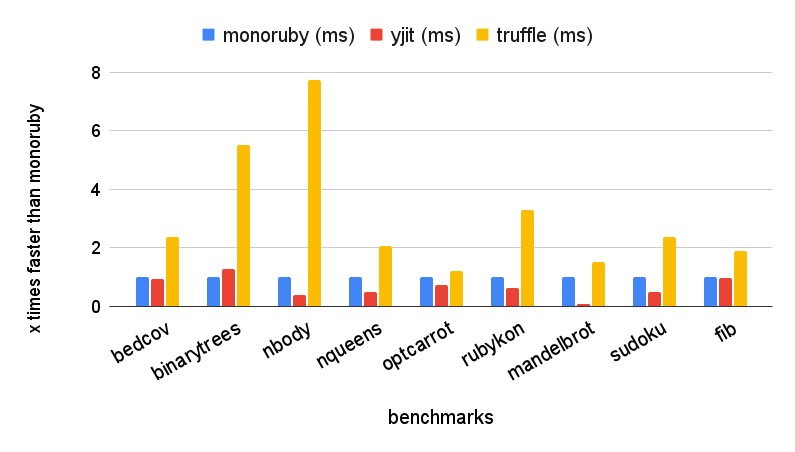

# monoruby

[](https://github.com/sisshiki1969/monoruby/actions/workflows/rust.yml)
[](https://codecov.io/gh/sisshiki1969/monoruby)

Ruby implementation with yet another JIT compiler written in Rust.

## Presentation

Presentation movie and slides for [RubyKaigi2024](https://rubykaigi.org/2024/presentations/s_isshiki1969.html#day2) are [here](https://www.youtube.com/watch?v=OfeUyQDFy_Y) and [here](./doc/RunningOptcarrotOnMyOwnRuby-Added.pdf).

## Features

- Written in Rust from scratch. No dependencies on any other Ruby implementations.
- Fast. Currently, monoruby is comparable to ruby3.4.1+YJIT in the optcarrot benchmark.
- Hand-written original parser.
- Register-based bytecode.
- Bytecode executor (virtual machine) written in x86-64 assembly (yes, we currently support only x86-64!).
- A compact and fast just-in-time compiler. (internally using self-made dynamic assembler [monoasm](https://github.com/sisshiki1969/monoasm))

## Prerequisites

### Platform

Currently, only x86-64/linux is supported.

## Build and run

(1) Install nightly Rust.

First of all, install Rust nightly.
[Check here to install Rust](https://www.rust-lang.org/ja/tools/install)

_Caution!!_ **only nightly Rust works** for monoruby.
[See here to work with nightly Rust](https://rust-lang.github.io/rustup/concepts/channels.html#working-with-nightly-rust).

(2) Clone this repository.

```sh
> git clone https://github.com/sisshiki1969/monoruby.git
> cd monoruby
```

(3) Build and run monoruby with Ruby script file.

```sh
> cargo run test.rb
```

or

```sh
> cargo run --release -- test.rb
```

for release build.

one liner.

```sh
> cargo run -- -e "puts 100"
```

(4) Launch REPL.

```sh
> cargo run --bin irm
```

or

```sh
> bin/irm
```

## Install

To install monoruby,

```sh
> cargo install --path monoruby
```

Now, you can play with monoruby,

```sh
> monoruby test.rb
```

and its REPL.

```sh
> irm
```

## Benchmark

### 1. optcarrot banechmark

Please see wiki for details. (https://github.com/sisshiki1969/monoruby/wiki/optcarrot_benchmark)

Several Ruby implementations described below were measured by [optcarrot](https://github.com/mame/optcarrot) benchmark.

- ruby 3.4.0dev (2024-04-27T08:56:20Z master 9ea77cb351) [x86_64-linux]
- truffleruby 24.0.1, like ruby 3.2.2, Oracle GraalVM JVM [x86_64-linux]
- truffleruby 24.0.1, like ruby 3.2.2, Oracle GraalVM Native [x86_64-linux]
- monoruby: 3e348afd4141c40978342e67ad26d42dc0b8d2a7

#### optcarrot benchmark


#### optcarrot fps history (0-3000 frames)


### 2. micro benchmark

please see wiki for details. (https://github.com/sisshiki1969/monoruby/wiki/micro_benchmark)

- measured by [yjit-bench](https://github.com/Shopify/yjit-bench) with '--harness=harness-warmup' option.
- benchmark codes are in [the official repo](https://github.com/ruby/ruby/tree/master/benchmark) and [plb2](https://github.com/attractivechaos/plb2).

#### Version of used Rubies

- monoruby: monoruby 0.3.0
- yjit: ruby 3.4.1 (2024-12-25 revision 48d4efcb85) +YJIT +PRISM [x86_64-linux]
- truffleruby-24.1.1: truffleruby 24.1.1, like ruby 3.2.4, Oracle GraalVM Native [x86_64-linux]

| bench         | monoruby (ms) | RSS (MiB) | yjit (ms) | RSS (MiB) | truffle (ms) | RSS (MiB) | monoruby/yjit | monoruby/truffle |
| :------------ | ------------: | --------: | --------: | --------: | -----------: | --------: | ------------: | ---------------: |
| bedcov        |        4412.0 |     234.3 |    4803.9 |     413.8 |       1881.8 |    1909.5 |         0.918 |            2.345 |
| binarytrees   |         175.0 |      28.7 |     137.0 |      22.0 |         31.7 |    1126.4 |         1.278 |            5.525 |
| matmul        |          39.7 |      35.0 |     121.8 |      22.8 |          1.4 |     803.2 |         0.326 |           29.059 |
| nbody         |           8.5 |      27.7 |      21.9 |      14.0 |          1.1 |     690.2 |         0.389 |            7.473 |
| nqueens       |          14.7 |      24.7 |      31.0 |      14.2 |          7.2 |     637.9 |         0.475 |            2.044 |
| optcarrot     |         520.4 |      79.0 |     720.9 |      54.7 |        432.2 |    1506.3 |         0.722 |            1.204 |
| rubykon       |         214.9 |      34.9 |     348.2 |      18.6 |         65.2 |    2279.9 |         0.617 |            3.298 |
| so_mandelbrot |          39.9 |      22.9 |     509.5 |      14.5 |         26.3 |     548.8 |         0.078 |            1.517 |
| sudoku        |          41.6 |      23.9 |      88.8 |      14.9 |         17.5 |    1165.2 |         0.469 |            2.381 |
| fib           |          16.7 |      23.5 |      17.4 |      15.0 |          8.8 |     483.4 |         0.960 |            1.895 |

Legend:

- monoruby/yjit: ratio of monoruby/yjit time. Higher is better for yjit. Above 1 represents a speedup.
- monoruby/truffle: ratio of monoruby/truffleruby-24.1.1 time. Higher is better for truffleruby. Above 1 represents a speedup.


