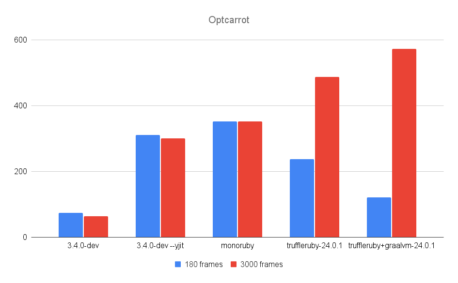
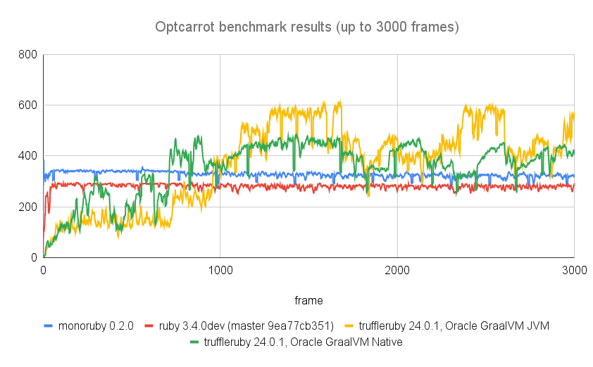
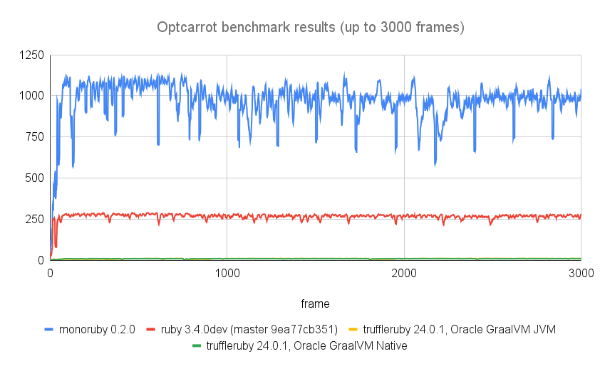
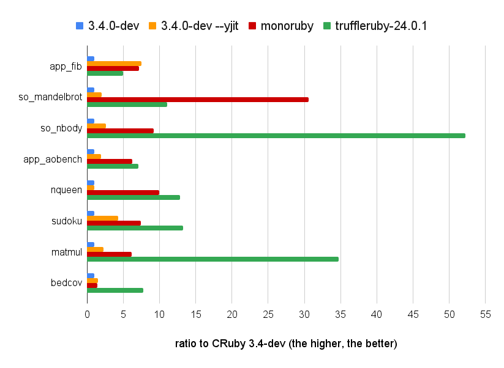

# monoruby

[](https://github.com/sisshiki1969/monoruby/actions/workflows/rust.yml)
[](https://codecov.io/gh/sisshiki1969/monoruby)

Ruby implementation with yet another JIT compiler written in Rust.

## Features

- Written in Rust from scratch. No dependencies on any other Ruby implementations.
- Fast. Currently, monoruby is comparable to ruby3.3.0+YJIT in the optcarrot benchmark.
- Hand-written original parser.
- Register-based bytecode.
- Bytecode executor (virtual machine) written in x86-64 assembly (yes, we currently support only x86-64!).
- A compact and fast just-in-time compiler. (internally using self-made dynamic assembler [monoasm](https://github.com/sisshiki1969/monoasm))

## Prerequisites

### Platform

Currently, only x86-64/linux is supported.

### Build

To build monoruby, You'll need installation of Rust.
Please be aware that **only nightly Rust works** for monoruby.

[Check here to install Rust](https://www.rust-lang.org/ja/tools/install),
and [see here to work with nightly Rust](https://rust-lang.github.io/rustup/concepts/channels.html#working-with-nightly-rust).

## How to run

To run ruby program file on monoruby,

```sh
> cargo run test.rb
```

or

```sh
> cargo run --release -- test.rb
```

one liner.

```sh
> cargo run -- -e "puts 100"
```

And also, you can launch REPL.

```sh
> cargo run --bin irm
```

or

```sh
> ./irm.sh
```

## How to install

To install monoruby,

```sh
> cargo install --path monoruby
```

Now, you can play with monoruby,

```sh
> monoruby test.rb
```

and its REPL.

```sh
> irm
```

## Benchmark

### machine spec

- Architecture: x86_64
- CPU(s): 32
  - Model name: 13th Gen Intel(R) Core(TM) i9-13900HX
  - Thread(s) per core: 2
  - Core(s) per socket: 16
- Caches (sum of all):
  - L1d: 768 KiB (16 instances)
  - L1i: 512 KiB (16 instances)
  - L2: 32 MiB (16 instances)
  - L3: 36 MiB (1 instance)

### optcarrot

Several Ruby implementations described below were measured by [optcarrot](https://github.com/mame/optcarrot) benchmark.

- ruby 3.4.0dev (2024-04-27T08:56:20Z master 9ea77cb351) [x86_64-linux]
- truffleruby 24.0.1, like ruby 3.2.2, Oracle GraalVM JVM [x86_64-linux]
- truffleruby 24.0.1, like ruby 3.2.2, Oracle GraalVM Native [x86_64-linux]
- monoruby: 3e348afd4141c40978342e67ad26d42dc0b8d2a7

#### optcarrot benchmark



#### optcarrot fps history (0-3000 frames)



##### with --opt option (self-rewriting optimization mode)



### micro benchmark

- measured by [benchmark-driver](https://github.com/benchmark-driver/benchmark-driver) with '--repeat-count 3' option.
- benchmark codes are in [the official repo](https://github.com/ruby/ruby/tree/master/benchmark) and [plb2](https://github.com/attractivechaos/plb2).
- measurements are shown in iteration/sec (the higher, the better).
- warm up cycles prior to measurement; 50 cycles for mandelbrot and 200 cycles for nbody. (see benchmark/so_mandelbrot.yml and so_nbody.yml)

|             | 3.4-dev | 3.4-dev --yjit | truffleruby+graalvm-24.0.1 | truffleruby-24.0.1 | monoruby | monoruby --no-jit |
| :---------- | ------: | -------------: | -------------------------: | -----------------: | -------: | ----------------: |
| app_fib     |   5.473 |         41.195 |                      6.988 |             27.447 |   39.174 |             9.912 |
| mandelbrot  |   0.980 |          1.983 |                      8.662 |             10.833 |   29.979 |             1.044 |
| nbody       |   1.736 |          4.543 |                     80.551 |             90.610 |   15.966 |             1.301 |
| app_aobench |   0.049 |          0.094 |                      0.276 |              0.346 |    0.305 |             0.044 |
| nqueen      |   0.015 |          0.015 |                      0.206 |              0.193 |    0.150 |             0.021 |
| sudoku      |   0.018 |          0.077 |                      0.207 |              0.238 |    0.133 |             0.020 |
| matmul      |   0.010 |          0.023 |                      0.332 |              0.347 |    0.062 |             0.007 |
| bedcov      |   0.033 |          0.049 |                      0.222 |              0.257 |    0.048 |             0.033 |

ratio to CRuby 3.4-dev were shown in the graph below.


