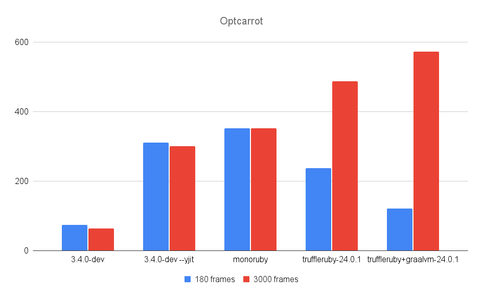
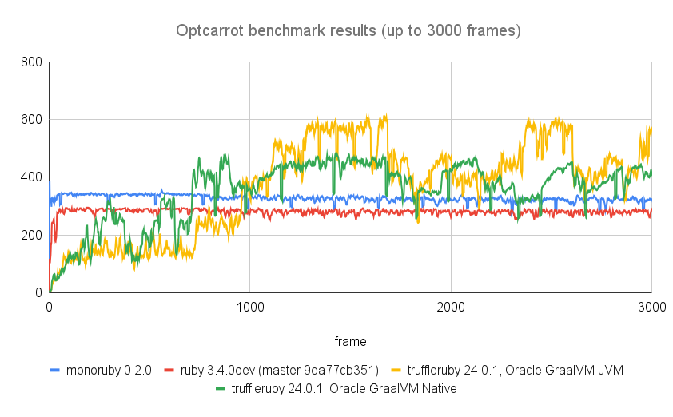
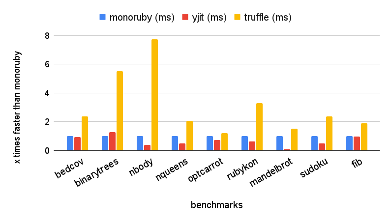

# monoruby

[](https://github.com/sisshiki1969/monoruby/actions/workflows/rust.yml)
[](https://codecov.io/gh/sisshiki1969/monoruby)
[](https://justforfunnoreally.dev)

Ruby implementation with yet another JIT compiler written in Rust.

- 📖 **[Documentation](https://sisshiki1969.github.io/monoruby/docs/)** — [installation and build](https://sisshiki1969.github.io/monoruby/docs/installation.html), [development and build options](https://sisshiki1969.github.io/monoruby/docs/development.html), [benchmark](https://sisshiki1969.github.io/monoruby/docs/benchmarks.html), [compatibility](https://sisshiki1969.github.io/monoruby/docs/compatibility.html) and the full [changelog](https://sisshiki1969.github.io/monoruby/docs/changelog.html), plus architecture overviews and the design documents.
- 📊 **[Project portal](https://sisshiki1969.github.io/monoruby/)** — benchmark and ruby/spec dashboards, re-measured on every push to `master` that touches the interpreter.

## What's New

Highlights from the last two months; earlier months are in the changelog, linked at the end of this section.

<!-- BEGIN LATEST-MONTHS: generated by bin/sync-changelog-readme; edit docs/src/changelog.md -->

### August 2026

- Broad early-month ruby/spec compliance drive across Kernel, Enumerator, IO and process handling: `Enumerator::Lazy` / `Product` / `Chain`, fiber-free `#each`/`#with_index` internals, ARGF reimplemented in Rust, Refinements, and a full spawn-exec engine with real `Data` subclasses ([#1039](https://github.com/sisshiki1969/monoruby/pull/1039)–[#1065](https://github.com/sisshiki1969/monoruby/pull/1065), notably [#1046](https://github.com/sisshiki1969/monoruby/pull/1046), [#1054](https://github.com/sisshiki1969/monoruby/pull/1054), [#1064](https://github.com/sisshiki1969/monoruby/pull/1064)).
- Signal delivery moved onto gated safepoint polls, and the safepoint word was reworked into one process-global, four-byte-lane poll; `gc-stress` then went opt-in and ran at every safepoint on both arches, catching a string of unrooted-`Value` and FP-pool bugs ([#1070](https://github.com/sisshiki1969/monoruby/pull/1070)–[#1075](https://github.com/sisshiki1969/monoruby/pull/1075), [#1123](https://github.com/sisshiki1969/monoruby/pull/1123)–[#1125](https://github.com/sisshiki1969/monoruby/pull/1125)).
- Hash subsystem overhaul: an AR-mode small-hash table embedded directly in the `RValue` cell, JIT-inlined accessors (`[]=`, `size`, `default`, …), and correctness fixes for tombstone deletes and iteration order ([#1060](https://github.com/sisshiki1969/monoruby/pull/1060), [#1086](https://github.com/sisshiki1969/monoruby/pull/1086)–[#1108](https://github.com/sisshiki1969/monoruby/pull/1108)).
- JIT dispatch modernization: polymorphic call and comparison sites now dispatch through the PIC instead of guarding and evicting, with BinOp/BinCmp lowering unified into one skeleton ([#1110](https://github.com/sisshiki1969/monoruby/pull/1110), [#1127](https://github.com/sisshiki1969/monoruby/pull/1127)–[#1133](https://github.com/sisshiki1969/monoruby/pull/1133)).
- Chain deopt became the sole recovery path off a stale JIT frame, followed by a multi-week abstract-state and frame-chain rework (unified joins, outer-frame float promotion across block calls) that got the ActiveRecord benchmark running both correctly and fast ([#1134](https://github.com/sisshiki1969/monoruby/pull/1134), [#1136](https://github.com/sisshiki1969/monoruby/pull/1136), [#1149](https://github.com/sisshiki1969/monoruby/pull/1149)–[#1168](https://github.com/sisshiki1969/monoruby/pull/1168), [#1171](https://github.com/sisshiki1969/monoruby/pull/1171)–[#1198](https://github.com/sisshiki1969/monoruby/pull/1198)).
- aarch64 kept pace with the chain-deopt work: outlined side-exit islands, branch-range relaxation past the `Imm19` reach, and ports of the class-version recovery jump-back ([#1153](https://github.com/sisshiki1969/monoruby/pull/1153), [#1175](https://github.com/sisshiki1969/monoruby/pull/1175), [#1176](https://github.com/sisshiki1969/monoruby/pull/1176), [#1182](https://github.com/sisshiki1969/monoruby/pull/1182), [#1183](https://github.com/sisshiki1969/monoruby/pull/1183), [#1189](https://github.com/sisshiki1969/monoruby/pull/1189)).
- Late-month perf sprint: cached `Symbol#to_proc` procs, dispatch-free Array/Range scans and equality-by-identity fast paths, plus a JIT correctness fix for inlined `send` and `method_missing` dispatch ([#1200](https://github.com/sisshiki1969/monoruby/pull/1200)–[#1214](https://github.com/sisshiki1969/monoruby/pull/1214)).
- Consolidated the README and wiki into the mdBook documentation site and added this generated Changelog chapter ([#1215](https://github.com/sisshiki1969/monoruby/pull/1215), [#1216](https://github.com/sisshiki1969/monoruby/pull/1216)).

### July 2026

- Big language-semantics compliance drive on the ruby/spec "language" group: destructuring, block-argument semantics, `defined?`, flip-flops, `BEGIN`/`END`, and predefined globals ([#804](https://github.com/sisshiki1969/monoruby/pull/804)–[#874](https://github.com/sisshiki1969/monoruby/pull/874), notably [#861](https://github.com/sisshiki1969/monoruby/pull/861)).
- Implemented pattern matching (`case`/`in`, `=>`) ([#883](https://github.com/sisshiki1969/monoruby/pull/883)) and MRI's full eigenclass tower ([#877](https://github.com/sisshiki1969/monoruby/pull/877)).
- Green threads (M:1): scheduler core, real Thread / Mutex / Queue, scheduler-integrated blocking IO, and preemptive timeslice multithreading ([#941](https://github.com/sisshiki1969/monoruby/pull/941)–[#944](https://github.com/sisshiki1969/monoruby/pull/944), [#962](https://github.com/sisshiki1969/monoruby/pull/962)).
- Real TCP / UDP / UNIX-domain sockets ([#964](https://github.com/sisshiki1969/monoruby/pull/964), [#981](https://github.com/sisshiki1969/monoruby/pull/981)); `IO::Buffer` with mmap file mapping ([#927](https://github.com/sisshiki1969/monoruby/pull/927), [#931](https://github.com/sisshiki1969/monoruby/pull/931)); `IO.copy_stream` ([#924](https://github.com/sisshiki1969/monoruby/pull/924)).
- Added the `setup-monoruby` GitHub Action with prebuilt binaries ([#884](https://github.com/sisshiki1969/monoruby/pull/884), [#886](https://github.com/sisshiki1969/monoruby/pull/886)) and CRuby-compatible command-line option processing ([#891](https://github.com/sisshiki1969/monoruby/pull/891)).
- Completed the Exception API: raise-time backtraces, `full_message`, NameError / NoMethodError metadata ([#893](https://github.com/sisshiki1969/monoruby/pull/893)–[#896](https://github.com/sisshiki1969/monoruby/pull/896)).
- Brought the aarch64 JIT to optimization parity with x86-64 ([#993](https://github.com/sisshiki1969/monoruby/pull/993)–[#1004](https://github.com/sisshiki1969/monoruby/pull/1004)) and shrank call frames for ~7% faster fib ([#850](https://github.com/sisshiki1969/monoruby/pull/850)).
- Completed `Fiber` — transfer / raise / kill / storage and a real root fiber, making core/fiber fully green ([#1036](https://github.com/sisshiki1969/monoruby/pull/1036)) — and refined Thread semantics: the async `Thread#raise` protocol and structured `Thread::Backtrace::Location` ([#1026](https://github.com/sisshiki1969/monoruby/pull/1026), [#1027](https://github.com/sisshiki1969/monoruby/pull/1027)).
- JIT: object allocation emitted as inline machine code (free-list pop + bump) ([#1011](https://github.com/sisshiki1969/monoruby/pull/1011)), guard-free slot dispatch for method calls on aarch64 ([#1010](https://github.com/sisshiki1969/monoruby/pull/1010)), and trivial-method folding through `...` forwards ([#1012](https://github.com/sisshiki1969/monoruby/pull/1012)).
- Encoding: streaming `Encoding::Converter` state and `String#encode` fallback / newline decorators ([#1018](https://github.com/sisshiki1969/monoruby/pull/1018), [#1019](https://github.com/sisshiki1969/monoruby/pull/1019)); Regexp gained native-encoding byte matching for non-UTF-8 subjects plus upstream Onigmo engine fixes ([#1037](https://github.com/sisshiki1969/monoruby/pull/1037), [#1038](https://github.com/sisshiki1969/monoruby/pull/1038)).
- CRuby-compatible `require` / `load` / `autoload` resolution rules ([#1033](https://github.com/sisshiki1969/monoruby/pull/1033)), a Rust fnmatch engine backing `Dir.glob` ([#1017](https://github.com/sisshiki1969/monoruby/pull/1017)), and an mdBook documentation site published to [the project portal](https://sisshiki1969.github.io/monoruby/docs/) ([#1008](https://github.com/sisshiki1969/monoruby/pull/1008)).

<!-- END LATEST-MONTHS -->

Earlier months: [Changelog](https://sisshiki1969.github.io/monoruby/docs/changelog.html) (from January 2026), and [Progress summary (April 2025 – April 2026)](https://sisshiki1969.github.io/monoruby/docs/design/progress_2025-2026.html) for a prose account of the same period.

## Presentation

- Presentation movie and slides for RubyKaigi2024 is [here](https://rubykaigi.org/2024/presentations/s_isshiki1969.html#day2).
- Presentation movie and slides for RubyKaigi2025 is [here](https://rubykaigi.org/2025/presentations/s_isshiki1969.html#day2).

## Features

- Written in Rust from scratch. No dependencies on any other Ruby implementations.
- Fast. Currently, monoruby is comparable to ruby 4.0.5+YJIT/ZJIT on many benchmarks, not just optcarrot.
- Parses Ruby source with [prism](https://github.com/ruby/prism), the official Ruby parser (the original hand-written parser was replaced in May 2026).
- Register-based bytecode.
- Bytecode executor (virtual machine) emitting machine code directly, for both x86-64 and aarch64 (Apple Silicon).
- A compact and fast just-in-time compiler with full backends for x86-64 and aarch64. (internally using self-made dynamic assembler [monoasm](https://github.com/sisshiki1969/monoasm))

## Compatibility

Conformance with Ruby has improved dramatically over the course of 2026, driven by an extensive [ruby/spec](https://github.com/ruby/spec)-based compliance effort.
Pass rates are re-measured on every interpreter change and published on the project portal: as of commit `a13bfe0` (2026-08-31) monoruby passes **97.6%** of the [core specs](https://sisshiki1969.github.io/monoruby/spec/) (22468 / 23029 examples) and **59.1%** of the [library specs](https://sisshiki1969.github.io/monoruby/library/).
As of July 2026 it also passed 100% of the command-line specs and 99.6% of the language specs.
Daily-updated pass statistics, compared with CRuby / TruffleRuby / JRuby, are published at [rubyspec-stats](https://sisshiki1969.github.io/rubyspec-stats/).

The [Compatibility](https://sisshiki1969.github.io/monoruby/docs/compatibility.html) chapter of the documentation breaks the numbers down by category, explains how they are measured, and lists the behaviours that differ from CRuby by design.

## Prerequisites

### Platform

- x86-64 Linux
- aarch64 — macOS on Apple Silicon is fully supported (VM + JIT); CI runs natively on GitHub's Apple Silicon (`macos-latest`) runners. Linux arm64 works as well.

## How to run

See [Installation and Build](https://sisshiki1969.github.io/monoruby/docs/installation.html) for prebuilt binaries, platform notes, what the build installs, and the full command-line reference.

(1) Install Rust.

[Check here to install Rust](https://www.rust-lang.org/tools/install) if you have no Rust yet.

_Caution!!_ **only nightly Rust works** for monoruby. You do not have to select the channel yourself: `rust-toolchain.toml` pins the exact nightly the project is tested against, and `rustup` installs and uses it automatically the first time you run `cargo` in the checkout.

(2) Clone this repository.

```sh
> git clone https://github.com/sisshiki1969/monoruby.git
> cd monoruby
```

(3) Build and run monoruby with Ruby script file.

```sh
> cargo run --release -- test.rb
```

(4) or, Launch REPL.

```sh
> cargo run --bin irm
```

or

```sh
> bin/irm
```

(5) or, install `monoruby` and `irm` onto your `PATH`.

```sh
> cargo install --path monoruby
> monoruby test.rb
> irm
```

## Using monoruby in GitHub Actions

This repository doubles as a `setup-monoruby` action (see `action.yml`),
modeled after [ruby/setup-ruby](https://github.com/ruby/setup-ruby). The ref
after `@` selects the monoruby version to install:

```yaml
steps:
  - uses: sisshiki1969/monoruby@master # or a release tag
  - run: monoruby my_script.rb
```

The action first tries to download a prebuilt binary attached to a GitHub
release (built by the `release binaries` workflow), which installs in seconds:
release tags use their own release's assets, while `@master` / `@nightly` use
the rolling `nightly` prerelease, rebuilt on every master push (so it
can lag a just-pushed HEAD by one build, ~15 min). Automatic builds cover
x86-64 Linux only; assets for Linux arm64 and macOS arm64 are published on
demand by dispatching the `release binaries` workflow with the wanted tag and
targets. When no asset exists for the ref/platform — or
`prefer-prebuilt: 'false'` is set — the action falls back to building monoruby
from source on the first run for each monoruby revision × runner OS/arch and
caches the resulting binary and runtime tree with `actions/cache`, so
subsequent runs restore in seconds. Linux (x64/arm64) and macOS (Apple
Silicon) hosted runners are supported either way.

Inputs and outputs:

| Name                        | Kind   | Description                                                            |
| --------------------------- | ------ | ---------------------------------------------------------------------- |
| `prefer-prebuilt` (`'true'`)| input  | Set to `'false'` to skip release assets and build the exact ref        |
| `cache` (`'true'`)          | input  | Set to `'false'` to disable the source-build cache                     |
| `cache-version` (`'v1'`)    | input  | Mixed into the cache key; bump to discard existing caches              |
| `prebuilt`                  | output | `'true'` if a prebuilt release asset was used                          |
| `cache-hit`                 | output | `'true'` if the built binary was restored from cache                   |
| `monoruby-version`          | output | Output of `monoruby --version`                                         |
| `ruby-version`              | output | `RUBY_VERSION` reported by the installed monoruby                      |

## Benchmark

Up-to-date benchmark results (yjit-bench, re-measured on every interpreter change) and the ruby/spec compliance dashboards are published on [the project portal](https://sisshiki1969.github.io/monoruby/). On the x86-64 run of commit `a13bfe0` (2026-08-31), over the 59 benchmarks that completed on both interpreters, monoruby averaged 1.28x the speed of CRuby+YJIT (geometric mean).

The [Benchmarks](https://sisshiki1969.github.io/monoruby/docs/benchmarks.html) chapter of the documentation explains the measurement methodology and how to reproduce a run locally. The numbers below are older one-off measurements, kept for the record.

### 1. Optcarrot benchmark

Several Ruby implementations described below were measured by [optcarrot](https://github.com/mame/optcarrot) benchmark.
See [Benchmarks — optcarrot](https://sisshiki1969.github.io/monoruby/docs/benchmarks.html#optcarrot-april-2024) for details.

#### Versions of used Rubies

- ruby 3.4.0dev (2024-04-27T08:56:20Z master 9ea77cb351) [x86_64-linux]
- truffleruby 24.0.1, like ruby 3.2.2, Oracle GraalVM JVM [x86_64-linux]
- truffleruby 24.0.1, like ruby 3.2.2, Oracle GraalVM Native [x86_64-linux]
- monoruby: 3e348afd4141c40978342e67ad26d42dc0b8d2a7

#### Optcarrot benchmark



#### Optcarrot fps history (0-3000 frames)



### 2. Other benchmarks

Several Ruby implementations described below were measured by [yjit-bench](https://github.com/Shopify/yjit-bench).
See [Benchmarks — yjit-bench](https://sisshiki1969.github.io/monoruby/docs/benchmarks.html#yjit-bench-december-2024) for the raw data.

#### Versions of used Rubies

- monoruby: monoruby 0.3.0
- yjit: ruby 3.4.1 (2024-12-25 revision 48d4efcb85) +YJIT +PRISM [x86_64-linux]
- truffleruby-24.1.1: truffleruby 24.1.1, like ruby 3.2.4, Oracle GraalVM Native [x86_64-linux]

#### Results

The graph shows the speed ratio against truffleruby. (higher is better)


