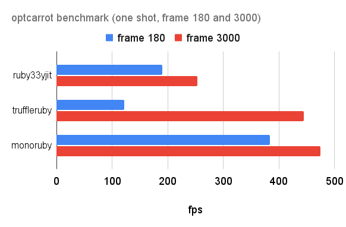
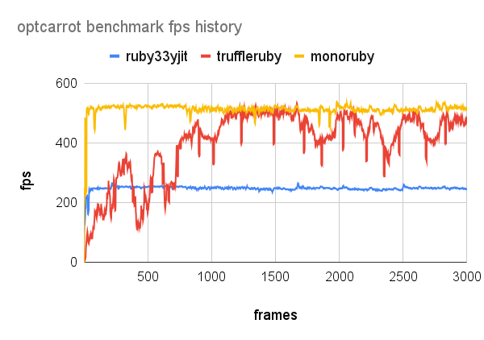
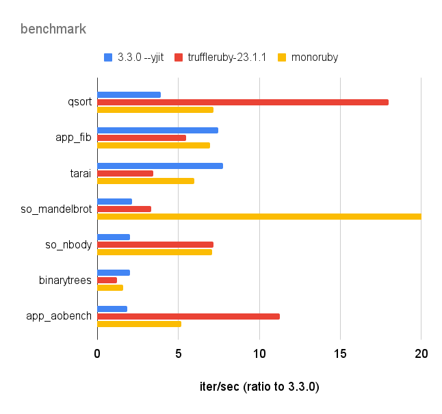

# monoruby

[](https://github.com/sisshiki1969/monoruby/actions/workflows/rust.yml)
[](https://codecov.io/gh/sisshiki1969/monoruby)

Ruby implementation with yet another JIT compiler written in Rust.

## Features

- Written in Rust from scratch. No dependencies on any other Ruby implementations.
- Fast. Currently, monoruby is comparable to ruby3.3.0+YJIT in the optcarrot benchmark.
- Hand-written original parser.
- Register-based bytecode.
- Bytecode executor (virtual machine) written in x86-64 assembly (yes, we currently support only x86-64!).
- A compact and fast just-in-time compiler. (internally using self-made dynamic assembler [monoasm](https://github.com/sisshiki1969/monoasm))

## Prerequisites

### Platform

Currently, only x86-64/linux is supported.

### Build

To build monoruby, You'll need installation of Rust.
Please be aware that **only nightly Rust works** for monoruby.

[Check here to install Rust](https://www.rust-lang.org/ja/tools/install),
and [see here to work with nightly Rust](https://rust-lang.github.io/rustup/concepts/channels.html#working-with-nightly-rust).

## How to run

To run ruby program file on monoruby,

```sh
> cargo run test.rb
```

or

```sh
> cargo run --release -- test.rb
```

one liner.

```sh
> cargo run -- -e "puts 100"
```

And also, you can launch REPL.

```sh
> cargo run --bin irm
```

or

```sh
> ./irm.sh
```

## How to install

To install monoruby,

```sh
> cargo install --path monoruby
```

Now, you can play with monoruby,

```sh
> monoruby test.rb
```

and its REPL.

```sh
> irm
```

## Benchmark

### optcarrot

Several Ruby implementations described below were measured by [optcarrot](https://github.com/mame/optcarrot) benchmark.

- ruby33yjit: ruby 3.3.0 (2023-12-25 revision 5124f9ac75) +YJIT [x86_64-linux]fps: 232.57980491198208
- truffleruby: truffleruby 23.1.1, like ruby 3.2.2, Oracle GraalVM Native [x86_64-linux]
- monoruby: 3e348afd4141c40978342e67ad26d42dc0b8d2a7

#### optcarrot benchmark



#### optcarrot fps history (0-3000 frames)



#### machine spec

- Architecture: x86_64
- CPU(s): 32
  - Model name: 13th Gen Intel(R) Core(TM) i9-13900HX
  - Thread(s) per core: 2
  - Core(s) per socket: 16
- Caches (sum of all):
  - L1d: 768 KiB (16 instances)
  - L1i: 512 KiB (16 instances)
  - L2: 32 MiB (16 instances)
  - L3: 36 MiB (1 instance)

### micro benchmark

- measured by [benchmark-driver](https://github.com/benchmark-driver/benchmark-driver) with '--repeat-count 3' option.
- benchmark codes are [in the official repo](https://github.com/ruby/ruby/tree/master/benchmark), and in the benchmark directory (`qsort.rb` and `tarai.rb` etc, shown with \*) in this repo.
- measurements are shown in iteration/sec (the higher, the better).

|               |  3.3.0 | 3.3.0 --yjit | truffleruby-23.1.1 | monoruby | monoruby --no-jit |
| :------------ | -----: | -----------: | -----------------: | -------: | ----------------: |
| app_fib       |  6.002 |       43.535 |             32.699 |   40.039 |             5.838 |
| so_mandelbrot |  1.009 |        2.140 |              3.397 |   31.814 |             1.258 |
| so_nbody      |  1.896 |        3.959 |             13.364 |   13.585 |             1.408 |
| app_aobench   |  0.051 |        0.093 |              0.627 |    0.260 |             0.048 |
| quick_sort\*  | 1.773k |       7.005k |            31.249k |  13.332k |            3.024k |
| tarai\*       |  4.918 |       37.935 |             16.687 |   30.698 |             4.554 |
| binarytrees\* |  5.668 |       10.884 |              6.996 |    8.217 |             4.140 |

ratio to Ruby 3.3.0 were shown in the graph below.


