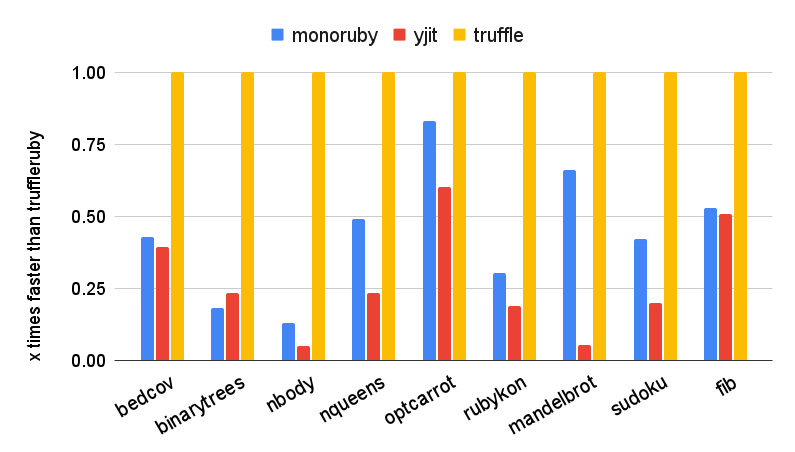

# monoruby

[](https://github.com/sisshiki1969/monoruby/actions/workflows/rust.yml)
[](https://codecov.io/gh/sisshiki1969/monoruby)

Ruby implementation with yet another JIT compiler written in Rust.

## Presentation

Presentation movie and slides for [RubyKaigi2024](https://rubykaigi.org/2024/presentations/s_isshiki1969.html#day2) are [here](https://www.youtube.com/watch?v=OfeUyQDFy_Y) and [here](./doc/RunningOptcarrotOnMyOwnRuby-Added.pdf).

## Features

- Written in Rust from scratch. No dependencies on any other Ruby implementations.
- Fast. Currently, monoruby is comparable to ruby3.4.1+YJIT in the optcarrot benchmark.
- Hand-written original parser.
- Register-based bytecode.
- Bytecode executor (virtual machine) written in x86-64 assembly (yes, we currently support only x86-64!).
- A compact and fast just-in-time compiler. (internally using self-made dynamic assembler [monoasm](https://github.com/sisshiki1969/monoasm))

## Prerequisites

### Platform

Currently, only x86-64/linux is supported.

## How to run

Please see [wiki](https://github.com/sisshiki1969/monoruby/wiki/Build-and-Install) for details. 

(1) Install nightly Rust.

First of all, install Rust nightly.
[Check here to install Rust](https://www.rust-lang.org/ja/tools/install)

_Caution!!_ **only nightly Rust works** for monoruby.
[See here to work with nightly Rust](https://rust-lang.github.io/rustup/concepts/channels.html#working-with-nightly-rust).

(2) Clone this repository.

```sh
> git clone https://github.com/sisshiki1969/monoruby.git
> cd monoruby
```

(3) Build and run monoruby with Ruby script file.

```sh
> cargo run --release -- test.rb
```

(4) or, Launch REPL.

```sh
> cargo run --bin irm
```

or

```sh
> bin/irm
```

## Benchmark

### 1. Optcarrot banechmark

Several Ruby implementations described below were measured by [optcarrot](https://github.com/mame/optcarrot) benchmark.
Please see [wiki](https://github.com/sisshiki1969/monoruby/wiki/Optcarrot_benchmark) for details. 

#### Versions of used Rubies

- ruby 3.4.0dev (2024-04-27T08:56:20Z master 9ea77cb351) [x86_64-linux]
- truffleruby 24.0.1, like ruby 3.2.2, Oracle GraalVM JVM [x86_64-linux]
- truffleruby 24.0.1, like ruby 3.2.2, Oracle GraalVM Native [x86_64-linux]
- monoruby: 3e348afd4141c40978342e67ad26d42dc0b8d2a7

#### Optcarrot benchmark


#### Optcarrot fps history (0-3000 frames)


### 2. Other benchmarks

Several Ruby implementations described below were measured by [yjit-bench](https://github.com/Shopify/yjit-bench).
Please see [wiki](https://github.com/sisshiki1969/monoruby/wiki/General-benchmarks) for details.

#### Versions of used Rubies

- monoruby: monoruby 0.3.0
- yjit: ruby 3.4.1 (2024-12-25 revision 48d4efcb85) +YJIT +PRISM [x86_64-linux]
- truffleruby-24.1.1: truffleruby 24.1.1, like ruby 3.2.4, Oracle GraalVM Native [x86_64-linux]

#### Results

The graph shows the speed ratio against truffleruby. (higher is better)


