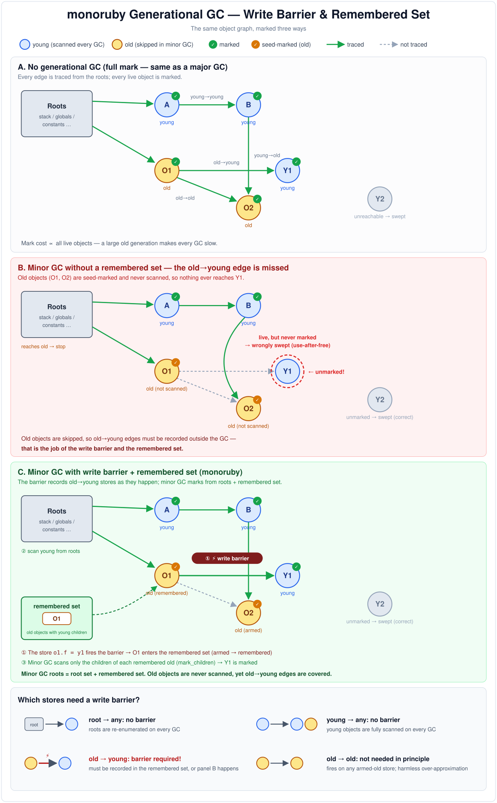
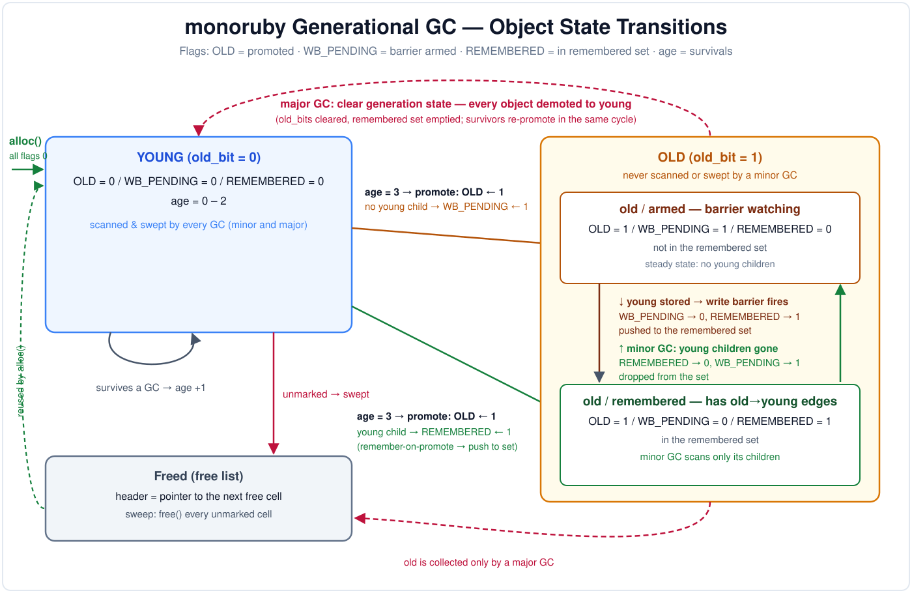

# monoruby の GC — 機構と実装

monoruby のガベージコレクタの**現行実装**を、コードに即して解説するドキュメント。
本書は「いま実際に動いているもの」を対象とする。

> 補足: `CLAUDE.md` は GC を「mark-and-sweep」と一言で書いているが、現行実装は
> より正確には **非移動(non-moving)・単一スレッド・stop-the-world の
> 世代別 mark & sweep**(CRuby の RGenGC に相当)である。世代別化は既に有効で、
> オブジェクトは実際に old 世代へ昇格し、マイナー/メジャー GC が使い分けられる。
> `alloc.rs` に残る一部コメント(「old_bits is always empty」「not enabled yet」等)は
> 実装より古い名残りである。実挙動は本書と該当コードを正とする。

主な実装ファイル:

| 対象 | ファイル |
| --- | --- |
| アロケータ・ページ・GC 本体 | `monoruby/src/alloc.rs` |
| `RValue` のヘッダ / マーク / 書き込みバリア | `monoruby/src/value/rvalue.rs` |
| セーフポイント・ルート走査・`execute_gc` | `monoruby/src/executor.rs` |
| GC poll のコード生成 | `monoruby/src/codegen/arch/{x86_64,aarch64}/…` |
| `GC` モジュールのビルトイン | `monoruby/src/builtins/gc.rs` |

---

## 1. 全体像

- **非移動 (non-moving)**: オブジェクトは一度確保したセルから動かない。コピーや
  コンパクションを行わないので、生ポインタ(`*const RValue`)を保持したまま GC を
  跨いでも安全。ページ・フリーリスト・スイープ機構をそのまま世代別化に流用できる。
- **単一スレッド・stop-the-world**: monoruby の VM は 1 本の OS スレッドで走る。
  GC は VM セーフポイントで同期的に実行され、並行 GC やインクリメンタル GC は
  持たない。
- **世代別 (generational)**: 弱い世代別仮説(多くのオブジェクトは若くして死ぬ)に
  基づき、マイナー GC ではマーク対象を「若い世代 + old→young 参照」に限定する。
  長命オブジェクトを多数抱えるワークロード(Rails 系・optcarrot 等)でのマーク
  コストを削減する。
- **保守的ではない (precise)**: ルートは明示的に列挙してマークする(スタックの
  値スキャンではない)。JIT コンパイル済みコードのセーフポイントでは、生きた
  レジスタをスタックに退避してからマークする。

コンパイルパイプライン全体における GC の位置づけは `CLAUDE.md` の
"Custom GC (`alloc.rs`)" と本書を対応させて読むとよい。

オブジェクトの状態遷移(世代間の移動と OLD / WB_ARMED / age
各フラグの変化)を 1 枚にまとめた図が
[gc_state_transitions.svg](gc_state_transitions.svg) にある(§6・§7 の図解版)。

---

## 2. ヒープのレイアウト

### 2.1 アロケータ

```
thread_local! { pub static ALLOC: RefCell<Allocator<RValue>> }   // alloc.rs
```

`Allocator<RValue>` はスレッドローカルなシングルトン(`alloc.rs:155`)。
`RValue` は 64 バイト固定(`GCBOX_SIZE`、`Allocator::new` で
`assert_eq!(64, GCBOX_SIZE)`)。

主なフィールド(`alloc.rs:299` 付近):

| フィールド | 意味 |
| --- | --- |
| `current_page` / `head_page` / `pages` | 現ページ / 最上位ページ / 割り当て済みページ一覧 |
| `used_in_current` | 現ページのバンプ位置 |
| `free` / `free_list_count` | フリーリスト先頭と要素数 |
| `free_pages` | 空きになって再利用待ちのページ |
| `total_gc_counter` / `minor_gc_count` / `major_gc_count` | GC 回数の各カウンタ |
| `minors_since_major` | 直近メジャー以降のマイナー回数(kind 判定に使用) |
| `old_count` | old 世代オブジェクト数(昇格で +1、メジャーで 0 リセット) |
| `old_major_threshold` | 適応的メジャー閾値(`old_count` がこれに達したら次はメジャー) |
| `promoting` | マーク中に昇格候補を収集するか(実マーク中のみ true) |
| `aging` | 今サイクルで生存した昇格候補(マーク後に加齢) |
| `remembered` | remembered set(old→young 参照を持つ old オブジェクト) |
| `pages_since_gc` | 前回の収集以降に `THRESHOLD` まで充填したページ数(8 で GC レーンを立てる) |
| `heap_frames` | ヒープに退避したフレームバッファの登録表(§9) |

### 2.2 アリーナとページ

```
const SIZE: usize        = 64;
const GCBOX_SIZE: usize  = size_of::<RValue>();          // 64
const PAGE_LEN: usize    = 64 * SIZE;                     // 4096 セル/ページ
const DATA_LEN: usize    = 64 * (SIZE - 1);               // 4032 データセル
const THRESHOLD: usize   = 64 * (SIZE - 2);               // 3968(ページ圧力を数える位置)
const ALLOC_SIZE: usize  = PAGE_LEN * GCBOX_SIZE;         // 262144 = 256KB
const MAX_PAGES: usize   = 8192;
```

- アリーナは起動時に **`ALLOC_SIZE * MAX_PAGES`(= 2GB)を 1 回だけ予約**する
  (`Allocator::new`、`System.alloc`)。実 RSS はページを使うぶんだけ増える
  (予約は仮想アドレス空間)。ページは 256KB 境界に整列。
- ページからポインタへの逆引きは**アドレスマスク**で O(1):
  `get_page(ptr) = ptr & !(ALLOC_SIZE - 1)`(`alloc.rs:1375`)。これにより任意の
  `*const RValue` から所属ページ(とマークビット)を即座に求められる。

`Page<T>`(`alloc.rs:1449`)の構造:

```
struct Page<T> {
    data:      [T; DATA_LEN],       // 4032 セル
    mark_bits: [u64; SIZE - 1],     // 63 ワード = セル1つにつき1ビットのマークビットマップ
    old_bits:  [u64; SIZE - 1],     // 63 ワード = old 世代ビットマップ(mark_bits と並行)
}
```

`size_of::<Page<T>>() <= ALLOC_SIZE` が `Allocator::new` で保証される。
`data` の後ろにビットマップ 2 枚が同居する(セル本体の外にマークを置く
mark-external 方式なので、生存中のオブジェクト内容を汚さない)。

---

## 3. 割り当て(`Allocator::alloc`)

`alloc.rs:779`。順序は以下:

1. **フリーリスト**が空でなければそこから 1 セル pop(`self.free`)。直前の GC で
   スイープされたセルの再利用。
2. 空でなければ**現ページのバンプ割り当て**。
   - `used_in_current == THRESHOLD`(3968)に達したら `on_page_pressure()` で
     `pages_since_gc += 1`、8 ページ目で poll ワードの GC レーンを立てる(GC を要求;§4)。
   - `used_in_current == DATA_LEN`(4032)でページ満杯 → `free_pages` から再利用、
     なければ `new_page()` で新規ページ。新ページは `clear_old_bits()` で
     old ビットマップを 0 初期化(マイナー GC のシード整合性のため)。

### JIT インライン高速パス

フリーリストからの pop は JIT がインライン展開できるよう、アロケータが
生アドレスを公開している:

- `free_list_head_addr()`(`self.free`) — `alloc.rs:658`
- `free_list_count_addr()` / `total_allocated_addr()` — 統計の同期用

JIT コードはセーフポイント外でのみこれらを触る(Rust 側が `ALLOC` を借用中や
`gc()` 実行中は触らない)ため、単一スレッド前提でエイリアスは生じない。

---

## 4. GC のトリガとセーフポイント

GC は「アロケーションの延長で即実行」はしない。JIT の生きたレジスタが未退避の
まま GC ルート走査に入るのは危険なため、**フラグを立てて次のセーフポイントで
実行**する。

### 4.1 poll ワードの GC レーン(`poll_flag.rs`)

VM/JIT が参照する poll ワード(`u32`、8bit×4 レーン。全体像は `doc/safepoint.md` §3)の
**byte 0 が GC レーン**。これを立てる経路:

| 経路 | 実装 | 操作 |
| --- | --- | --- |
| ページ圧力 | `on_page_pressure`(`alloc.rs`) | `pages_since_gc` が 8 に達したら `set_gc()` |
| malloc 圧(§8) | `request_gc_if_malloc_over` | `set_gc()` |
| `GC.start` | `request_gc(true)` | `set_gc()` + メジャー強制 |
| `GC.stress` | `set_stress(true)` / 各収集の末尾 | `set_gc()`(再武装) |

すべて冪等な `fetch_or` で、シグナル(SIGNAL レーン)・プリエンプト(PREEMPT レーン)とは
byte が分かれているため互いを踏み潰す競合は原理的にない。GC 判定は GC レーン単体で行うので、
純粋なプリエンプト tick やシグナル到着が偽の full GC を起こすことはない(§4.3 手順 2)。
収集の完了時は `ack_gc_request`(`alloc.rs`)が **GC レーンの byte だけ**を落とし、
`pages_since_gc` を 0 に戻す(並行して立った他レーンは保存される)。`--no-gc` 時の
空収集も同じ経路で要求を無効化するため、レーンが立ちっぱなしで poll が空回りすることはない。

### 4.2 poll のコード生成

`execute_gc_inner`(`codegen/arch/x86_64/jit_module.rs:255`)が poll を出力:

```asm
cmpl [rip + poll_flag], 0
jne  gc          ; いずれかのレーンが立っていれば slow path へ
exit:
; gc: (別ページ)
;   write_back(生きたレジスタを退避)
;   call exec_gc      ; = execute_gc()
;   testq rax, rax
;   jne  exit         ; nil 以外(=正常)なら復帰
;   jmp  error        ; None(=例外/シグナル)なら伝播
```

この poll は**呼び出し先エントリ(callee entry)とループのバックエッジ**という
セーフポイントで実行される(`vm_execute_gc`;`vmgen/init_method.rs` / `vm_loop_start` ほか。
call-site には poll を置かない — `doc/threads.md` §8.3)。aarch64 backend も
同等のゼロ判定(`ldr; cbz`)を出力する。

### 4.3 `execute_gc`(`executor.rs:3743`)

セーフポイントから呼ばれる `extern "C"` 関数。順に:

1. `watchdog::poll()` — ハングウォッチドッグのカウントダウンをリセット。
2. `poll_flag::consume_preempt()` で **PREEMPT レーンを消費**する。GC 判定は GC レーンで
   独立に行う(§4.1)。
3. **保留シグナルの処理** — SIGNAL レーンをクリアしてから `PENDING_SIGNALS` ビットマップを
   drain し、最小番号のシグナルを `Signal.trap` ハンドラ呼び出し / 既定例外(SIGINT ⇒
   `Interrupt` 等)に変換(`doc/signal.md`)。
4. **GC レーンが立っているときだけ** GC 本体を実行:`parent_fiber` を辿って
   **ルート Executor(最上位ファイバ)**へ行き、
   `ALLOC.with(|a| a.borrow_mut().gc(&Root { globals, executor }))`。
   drain できなかった保留シグナルがある poll では収集を次の poll へ延期する
   (`doc/signal.md` §4.1)。
5. プリエンプトビットが立っていて `scheduler::preempt_ok()` なら `scheduler::pass`
   (タイムスライス切替。`doc/threads.md` §8.4)。

---

## 5. オブジェクトヘッダとフラグ

`RValue` 先頭の `Header` は union(`rvalue.rs`):

```
union Header { next: Option<NonNull<RValue>>, meta: Metadata }

struct Metadata {          // rvalue.rs:2373
    flag:  u16,
    ty:    Option<ObjTy>,  // 1 バイト
    ty_flags: u8,          // ObjTy 固有のメタデータ(HASH: 小ハッシュ表現ビット)
    class: Option<ClassId>,
}
```

- フリーリスト上のセルは `next`(次の空きセル)として解釈され、生存セルは `meta`。
- `ty_flags` は ObjTy 固有のメタデータバイト。JIT の型判定は両アーキテクチャとも
  1 バイト読み(x86-64 `cmpb` / aarch64 `ldrb`)なので、隣接バイトが任意の値でも
  問題ない。HASH オブジェクトはここにインライン表現のビット(hash.rs の
  `HashFlags`)を置く。dup/リテラルコピー(`Header::newborn` /
  `CellHeader::NewbornOf`)はこのバイトを保存する。世代別 GC の age は従来どおり
  `flag` の上位バイトに置く。

### `flag: u16` のビット割り当て(`rvalue.rs:2447` 以降)

| ビット | マスク | 意味 |
| --- | --- | --- |
| 0 | `0b0000_0001` | LIVE(生存;確保時 `flag = 1`) |
| 1 | `0b0000_0010` | FROZEN |
| 2 | `0b0000_0100` | CHILLED(`Symbol#to_s` 由来の準 frozen 文字列) |
| 3 | `0b0000_1000` | **OLD**(old 世代へ昇格済み) |
| 4 | `0b0001_0000` | WB_UNPROTECTED(shady 用に予約。現状**未使用** — §7.3) |
| 5 | `0b0010_0000` | 空き(旧 REMEMBERED。「remembered set 登録済み」は専用ビットではなく **`OLD ∧ ¬WB_ARMED` で導出**する) |
| 6 | `0b0100_0000` | **WB_ARMED**(old かつ未 remembered = 書き込みバリアの slow path 対象) |
| 7 | `0b1000_0000` | CHILLED_LITERAL(リテラル由来の chilled 文字列;警告文言の出し分け用) |
| 8..15 | 上位バイト | **age**(生存回数;`RGENGC_OLD_AGE` で昇格。上位バイトは age 専用 — 下位バイトのフラグはここに置かないこと) |

新規オブジェクトは `flag == 1` なので、OLD / WB_ARMED はともに 0
(= young・バリア対象外)、age は 0 から始まる。

old オブジェクトの 2 状態は WB_ARMED 1 ビットで表す:
**armed = OLD ∧ WB_ARMED**、**remembered = OLD ∧ ¬WB_ARMED**。
remembered set の実体(列挙)は `Allocator::remembered`(Vec)であり、ヘッダ側は
バリアの高速パスが見る WB_ARMED だけを持つ。`arm_barrier`(WB_ARMED を立てる)と
`enter_remembered`(WB_ARMED を落とす)は単一ビットの反転で、
書き込みバリアの高速パスはこの 1 ビット(WB_ARMED)テストだけで済む。
「OLD=0 なのに WB_ARMED=1」は発生しない不正状態である。

---

## 6. 世代別 GC 本体(`Allocator::gc`, `alloc.rs:864`)

### 6.1 マイナー / メジャーの選択(`decide_gc_kind`, `alloc.rs:854`)

```
old_count >= old_major_threshold  ||  minors_since_major >= MAX_MINORS_PER_MAJOR
    → Major     それ以外 → Minor
```

- **適応的メジャー閾値** `old_major_threshold`: メジャー直後に
  `max(old_count * OLD_GROWTH_FACTOR, OLD_OBJECT_FLOOR)` へ再設定
  (`OLD_GROWTH_FACTOR = 2`, `OLD_OBJECT_FLOOR = 16384`)。old 世代が安定していれば
  メジャーは稀(世代別の利得を保つ)、浮遊ゴミを昇格し続けるワークロードでは
  頻繁にメジャーして RSS を抑える。CRuby の `RGENGC_OLD_OBJECT_LIMIT_FACTOR` に相当。
- **`MAX_MINORS_PER_MAJOR = 64`**: 安全上限。適応閾値が発火しなくても、64 回に 1 度は
  必ずメジャーして remembered set を作り直し、浮遊 old ゴミを回収する。
- `GC.start` は `GC_FORCE_MAJOR` を立てるので、次の収集は無条件にメジャー。

### 6.2 マークビットマップの準備

| kind | 操作 |
| --- | --- |
| **Major** | `clear_mark()`(mark_bits=0)+ `clear_old()`(old_bits=0, `old_count=0`)+ `remembered.clear()`。全オブジェクトが収集候補に戻り、ルートから再マーク・全スイープ。 |
| **Minor** | `seed_marks()`。各ページで `mark_bits ← old_bits` をコピー(`seed_mark_from_old`)。old オブジェクトは**最初からマーク済み**とみなされ、再走査もスイープもされない。 |

### 6.3 マークフェーズ

1. `self.promoting = true` にしてから `root.mark(self)`(ルートは §8)。
2. `RValue::mark`(`rvalue.rs:757`)は `gc_check_and_mark` でビットを立て、未マーク
   だった場合のみ `mark_children` で子を辿る(深さ優先)。
3. `gc_check_and_mark`(`alloc.rs:1007`)は、初めてマークしたセルが `promoting` かつ
   `is_promotable()` なら `aging` に積む(昇格候補の収集)。ヘッダ書き換えは
   マーク走査が握る `&self` とエイリアスしないよう**マーク後に遅延**する。
4. **Minor のみ** `mark_remembered()`:remembered set の各 old オブジェクトの
   *子だけ*を `mark_children` で辿る(親 old は既にシードマーク済み)。これにより
   「old からしか参照されていない young オブジェクト」に到達する。走査後、若い子が
   いなくなった entry は set から外して `arm_barrier`(自己クリーニング;
   `alloc.rs:1213`)。
5. `self.promoting = false`。

### 6.4 加齢と昇格(`apply_aging`, `alloc.rs:1048`)

マーク完了後(生きた `&self` が無い状態)に:

- **Pass 1**: `aging` の各生存者の age を +1(`age_and_check_promote`)。
  `age >= RGENGC_OLD_AGE`(= 3)に達したものを昇格:`old_bits` をセット +
  ヘッダ OLD をセット + `old_count += 1`。
  → **即時昇格ではなく「3 回生存したら昇格」**。1 回の収集でたまたま生きていた
    短命オブジェクトを old に上げてしまい浮遊ゴミ化するのを避ける。
- **Pass 2**: remember-on-promote。昇格したオブジェクトが**まだ young を参照して
  いる**(`young_child_exists`)なら remembered set に追加(バリア導入前から存在した
  old→young 辺をカバー)。young 参照が無ければ `arm_barrier` して以後の young ストアに
  備える。

### 6.5 マイナー後の検証(`gc-verify` フィーチャ)

マイナー GC の後、シード無し・昇格無しでルートから全ライブグラフを独立に再マーク
する(`alloc.rs:964`)。もしマイナーが到達可能なオブジェクトを解放していれば
(バリア漏れ/remembered set 漏れ)、この走査が解放済みセルに到達し
`RValue::mark` の `is_live` アサートが発火する。世代別 GC の健全性テスト。

---

## 7. 書き込みバリア

world 停止型・非移動なので、必要なのは **old→young 辺を remembered set に記録する
だけ**の単純なバリア。

バリアと remembered set が「なぜ必要か」(世代別 GC なし / remembered set なしの
minor GC / 完全な minor GC の 3 通りでのマーク走査の比較と、バリアが必要な辺の
分類)を図解したものが [gc_write_barrier.svg](gc_write_barrier.svg) にある。



### 7.1 実体(`RValue::write_barrier`, `rvalue.rs:1115`)

```rust
pub(crate) fn write_barrier(&mut self, child: Value) {
    if self.is_wb_armed() && !child.is_packed_value() {
        self.enter_remembered_set();
    }
}
```

- **高速パスはヘッダ 1 ビットのテスト**(`is_wb_armed` = WB_ARMED ビット)。
  young オブジェクトも、既に remembered な old オブジェクトも、このビットが 0 なので
  即 return(アロケータに触れない)。
- 子の世代は見ない(old→old を覚える過剰近似は無害)。即値(`is_packed_value`)は除外。
- `write_barrier_bulk`(`rvalue.rs:1128`)は `Array#concat` / `Hash#[]=` などの
  複数要素ストア用。個々の子を見ず、armed なら無条件に記録する過剰近似。

呼び出しは「参照型フィールド(ivar / 配列・ハッシュ要素 / struct スロット)へ
`child` を格納した**後**」。インタプリタ経路(`set_ivar`、Array/Hash ラッパ、
`Value::set_struct_slot` 等)と、JIT が出力するインラインバリア
(`emit_write_barrier_rdi`)の両方でカバーされる。

### 7.2 状態遷移



```
young(flag=1) ──[age>=3 で昇格]──▶ old
   昇格時に young 子あり ─▶ enter_remembered (WB_ARMED=0) ── remembered set 登録
   昇格時に young 子なし ─▶ arm_barrier      (WB_ARMED=1) ── 以後の young ストアを待つ
   armed な old に young ストア ─▶ write_barrier ─▶ enter_remembered_set ── set 登録 + WB_ARMED=0
   minor 走査で young 子が消えた remembered ─▶ arm_barrier に戻す(自己クリーニング)
```

生きている old については「WB_ARMED=0 ⇔ `Allocator::remembered` に登録済み」が
不変条件(専用の REMEMBERED ビットは持たない — §5)。remembered set の大きさは
「生きた old→young 辺の数」に比例し続ける(かつて young 子を持っていた全昇格
オブジェクトには比例しない)。

### 7.3 昇格可能性(`is_promotable`, `rvalue.rs:918`)

昇格してよいのは「**そのオブジェクトへの Value 格納経路がすべてバリア保護されている**」
型のみ。現状 `ty()` で判定し、以下が `true`:

```
OBJECT | STRING | BIGNUM | FLOAT | ARRAY | STRUCT | HASH
```

- OBJECT と各リーフ(String バイト列 / Bignum / ヒープ Float)は ivar 経由でしか
  Value を持たず、ivar ストアは全経路バリア済み。
- Array/Struct の要素ストア、Hash ストアもインタプリタ・JIT 双方でバリア済み。
- それ以外の型は昇格しない(マイナーで毎回走査される young のまま)。

> **WB_UNPROTECTED(bit4)** は「shady(バリアで追えない)オブジェクトは昇格しない」
> ための予約フラグだが、現状 `is_promotable` は型のみで判定し、このフラグは
> 参照されていない(`set_wb_unprotected` の呼び出し箇所は無い)。将来のための予約。

---

## 8. ルート(マーク開始点)

`Root`(`executor.rs:3713`)の `mark`(`executor.rs:3719`)が起点:

```
Root::mark → YIELDER.mark      (ブロック/ファイバの yielder)
           → Globals::mark     (globals.rs)
           → Executor::mark    (executor.rs:248)
           → scheduler::mark    (executor.rs:3729 — グリーンスレッドの root)
```

`Executor::mark`(`executor.rs:248`)が辿るもの:

- `temp_stack` の全 Value(ビルトインが GC を跨いで生かしたい一時値の退避先)。
- `cfp` 連鎖の各 `lfp()`(= すべての生きたスタックフレームのローカル変数・レシーバ等)。
- `lexical_class` 上の `DefinitionContext::Receiver(Value)`
  (`instance_eval`/`instance_exec` 中のレシーバ)。
- 保留例外 `exception`(`MonorubyErr` は packed Value を持つ;`MonorubyErr::mark`)。
- マッチ処理の一時退避 `sp_match_regex` / `sp_match_haystack`。
- `deferred_unwind`(ensure で中断した `MethodReturn`/`Throw` が握る Value と Lfp)。

`Globals::mark` はクラステーブル・定数・グローバル変数・呼び出しサイト等の
恒久ルートをマークする。

### グリーンスレッド(`scheduler::mark`)

green thread 導入後、GC ルートには**スケジューラの生存スレッド registry**が加わった
(`scheduler::mark`, `scheduler.rs`)。`Scheduler::mark` は `threads` / `current` / `main` /
`ready` / `sleepers` / `io_waiters` の全 Thread オブジェクトをマークし、`in_scheduler`
中は main の Executor(`main_exec`)も deref してマークする。各 Thread は
`impl GC for ThreadInner` を通じて自分の `handle` Executor(→ その CFP チェーン)と
proc/args/result/exception/joiners/pending/masks/last_status をマークする。

したがって GC は事実上**複数の Executor**をマークする:各 green thread の `handle` と、
`main_exec` 経由で辿る埋め込み側所有の main Executor。切替はセーフポイントでしか
起きないので、サスペンド中のどのスレッドのフレームも GC-complete
(詳細は `doc/threads.md` §2・§3.4・§8)。

### 8.1 ビルトインの一時値 — 素の `Vec<Value>` は**ルートではない**

ルート走査は上記の列挙がすべてなので、Rust 側のローカル(`Vec<Value>`、
`HashMap<_, Value>`、単なる `Value` 束など)は **GC からまったく見えない**。
`vm.invoke_block` / `vm.invoke_method_inner` / `vm.invoke_proc` はいずれも
任意の Ruby を走らせる = セーフポイントを跨ぐので、

> **原則**: Ruby 呼び出しを跨いで生かしたい `Value` は、必ず `temp_stack`
> (`temp_push` / `temp_array_new` + `temp_array_push` /
> `temp_array_extend_from_slice` / `with_temp_scope`)に載せる。

引数ベクタのように「組み立てた直後に 1 回だけ invoke へ渡す」用途は、
その間にセーフポイントが無いので素の `Vec` で構わない。危険なのは
**invoke をループで回しながら結果を貯めるアキュムレータ**である。

`Executor` にはこの型の定型処理を安全側に閉じ込めたヘルパがある:

| ヘルパ | 用途 |
| --- | --- |
| `invoke_block_iter1` | `each` 系(結果を捨てる) |
| `invoke_block_iter1_rooted` | 同上。イテレート元を先に materialise してルート付けする |
| `invoke_block_map1` | `map` 系(結果を 1 個ずつ push) |
| `invoke_block_flat_map1` | `flat_map` 系(Array なら展開して push) |

**実例(gc-stress CI の optcarrot abort)**: `Array#flat_map` は `#to_ary` 対応を足した際に
`invoke_block_flat_map1` から素の `let mut res: Vec<Value>` に書き換えられ、
ブロック呼び出しを跨いで貯めた要素がすべて未ルートになっていた。通常ビルドでは
GC の閾値に届かず表面化しなかったが、`gc-stress`(毎セーフポイント収集)では
optcarrot の `Palette.defacto_palette`(512 要素の `flat_map`)が返す Array が
解放済み RValue で埋まり、次のマークで `DEAD RVALUE reached in mark` で abort した。
再現は 9 行で足りる:

```ruby
src = [[1.0, 1.0, 1.0]] * 8
res = src.flat_map { |rf, gf, bf| (0...64).map { |i| [i * rf, i * gf, i * bf] } }
```

診断のコツ: `RValue::mark` の DEAD 検出点で、(a) `Lfp::mark` 側に
「いまマーク中のフレームの `func_id` とスロット番号」、(b) `RValue::mark` 側に
「いま children を辿っている親 RValue」を thread-local で持たせて出力すると、
*どのメソッドのどの一時値が壊れているか*が一発で分かる。今回は
`func=Video#initialize(driver.rb:67) slot=2 / parent=Array(len=512)` まで出て、
そこから `flat_map` に到達した。

---

## 9. スイープと空きページの回収

### スイープ(`sweep`, `alloc.rs:1269`)

ページごとに `mark_bits` を 64 ビット単位で走査(`sweep_bits`)。未マークセルを
`free()`(型に応じて `ManuallyDrop::drop`;`rvalue.rs:785`)してフリーリストに連結。
`trailing_ones` でマーク済みの連続領域を一気に飛ばす最適化がある。最後に
`self.free` がフリーリスト先頭に、`free_list_count` が回収数になる。

`free()` は多重呼び出しに耐える(`is_live()` を先頭で確認)。フリーリスト上のセルは
次のスイープでもう一度 free されうるため。

### 空きページの回収(`salvage_empty_pages`, `alloc.rs:1250`)

スイープ前に、全セルが未マーク(`all_dead`)のページを `pages` から外して
中身をドロップし `free_pages` へ戻す。以後の割り当てで再利用される(OS へは返さず、
アリーナ予約内で回す)。

---

## 10. ヒープに退避したフレーム(`heap_frames`)

クロージャ等でスタックフレームがその生成メソッドより長生きする場合、フレームは
`move_frame_to_heap` / `heap_frame` により `Box<[u64]>` としてヒープへ退避され、
`Box::into_raw` でリークされる。この生バッファを GC が回収できるよう、LFP アドレスを
キーに `heap_frames` へ登録する(`register_heap_frame`, `alloc.rs:563`)。

- マーク時、生きた LFP から到達したフレームに `marked` を立てる。
- `sweep_heap_frames`(`alloc.rs:603`)が、**2 サイクル連続で未マーク**だった
  フレームの `Box<[u64]>` を解放する(1 サイクルの猶予は昇格→ルート格納の窓を
  カバーするため)。
- キーは 8 バイト整列の LFP アドレスなので、既定の SipHash ではなく Fibonacci ハッシュ
  1 回(`AddrHasher`)で引く(`gc-stress` 下では毎確保ごとに引かれるため速度が効く)。

`heap_frames` が空のときは関連処理を丸ごとスキップし、コスト 0(optcarrot 等は
フレーム退避が稀)。

---

## 11. malloc 連動トリガ(外部バッファ圧)

`RValue` アリーナの圧力だけでは、`String#<<` ループのように **`RValue` をほとんど
作らずに malloc メモリだけ膨らむ**ケースを検知できない。そこでグローバル
アロケータ自身が外部バッファ量を追跡する:

- `RurubyAlloc`(`#[global_allocator]`, `alloc.rs:7`)が `alloc`/`dealloc` で
  `MALLOC_AMOUNT` を増減。
- **`MALLOC_TRACK_LIMIT = 64MB` 以上の確保は無視**。これは JIT メモリ予約
  (monoasm が起動時に 3 × 256MB を確保)のような一過性インフラ確保を除外するため。
  無視すると閾値が GB 級に張り付き、通常の String/Array/Hash 成長で永遠に GC が
  発火しなくなる。同じ判定で `dealloc` も gate するので `MALLOC_AMOUNT` は
  アンダーフローしない。
- `request_gc_if_malloc_over`(`alloc.rs`)が `MALLOC_AMOUNT >= MALLOC_GC_THRESHOLD`
  で poll ワードの GC レーンを立てる(GC 要求;割り当てフリーで安全)。
- 閾値 `MALLOC_GC_THRESHOLD` は各 GC 後に
  `malloced + max(malloced/2, MALLOC_THRESHOLD)` へ再設定(`alloc.rs:986`)。
  加算のみだと巨大ヒープでも 256KB ごとに GC してしまうので、乗算項で比例させる。
- この経路の収集は**メジャー強制しない**(一過性バッファは若くして死ぬのでマイナーで
  回収でき、old のバッファゴミは §6.1 のメジャートリガが拾う)。

---

## 12. GC の制御(`GC` モジュール, `builtins/gc.rs`)

| メソッド | 実装 | 挙動 |
| --- | --- | --- |
| `GC.start` | `builtins/gc.rb` + `__request_gc` | `request_gc(full_mark)` で収集を要求したあと、**ループ後方辺(セーフポイント)を跨いで `GC.count` が進むまで回る**ので、CRuby 同様に回収を終えてから返る。builtin の中で直接 `gc()` を呼べないのは、JIT 呼び出し元の生きたレジスタがセーフポイント以外では退避されておらずルート走査から見えないため。`full_mark: false` はマイナーを許す(強制しない)。 |
| `GC.disable` / `GC.enable` | `Globals::gc_enable(false/true)` | GC の有効/無効を切り替え、直前の disable 状態を bool で返す。`GC_ENABLED`(§4 の malloc 経路が参照)も同期。 |
| `GC.count` | `total_gc_counter` | 総 GC 回数。 |
| `GC.stat` | `stat`(CRuby 4.0 のキー順) | ページ数・スロット数・累計確保/解放オブジェクト数・old 世代・malloc 量・フェーズ別時間まで実カウンタ。圧縮とファイナライザ、CRuby 固有の old malloc 会計だけが 0(概念が無いため)。 |
| `GC.total_time` / `GC.measure_total_time` | `gc_time_ns` | `gc()` の実測ナノ秒。`measure_total_time = false` の間は計測自体を行わない(`GC::Profiler` が有効なら計測は続く)。 |
| `GC.stress` | `Allocator::stress` | 収集の最後に poll フラグをトリガ帯へ戻すので、**以降すべてのセーフポイントで収集**する。CRuby の「確保ごと」は JIT が確保の高速路をインライン化する都合で再現できないが、ルート漏れの炙り出しという用途は同じ。 |
| `GC.config` | `builtins/gc.rb` + `__allow_full_mark` | `:rgengc_allow_full_mark` は実ノブで、false の間 `decide_gc_kind` はメジャーを選ばない(明示的な `GC.start` は依然メジャーを強制する)。`:implementation` は読み取り専用。 |
| `GC.auto_compact` / `GC.compact` | — | `NotImplementedError`。monoruby の収集器はオブジェクトを移動しないので、CRuby が圧縮非対応環境で返すのと同じ答えを返す。 |
| `GC::Profiler` | `Allocator::profile` | 有効な間、収集ごとに `GcProfileRecord`(invoke time / 所要時間 / live バイト / ヒープ総バイト / 総スロット / メジャーか)を積む。`result` は CRuby と同じ表形式、`raw_data` は同じキー、`total_time` は秒の Float。 |

コマンドラインでは `--no-gc` で GC を無効化できる。GC 無効時は `gc()` が即 return
するため、`request_gc_if_malloc_over` は `GC_ENABLED` を見て要求自体をスキップする
(さもないとフラグがトリガ帯に張り付いて poll が空回りする)。

---

## 13. デバッグ・検証用フィーチャ

| フィーチャ | 効果 |
| --- | --- |
| `gc-log` | 終了時に GC 統計を出力(old 数の実 popcount 等)。 |
| `gc-debug` | GC 中の各種アサート・ダンプ。`old_count` と実 popcount の一致検証など。 |
| `gc-stress` | **毎セーフポイントで無条件に強制 GC**(実行時 `GC.stress` フラグとは独立。`execute_gc` が常に収集し、GC レーンを常時再アーム)。`bin/test` の nextest フェーズが使用(CI では x86-64 のみ)。世代別のバリア/remembered set 漏れや、Rust ローカルに保持したままの未ルート `Value` を最も強く炙り出す。 |
| `gc-verify` | マイナー GC 後に独立フル再マークで健全性検証(§6.5)。 |

環境変数 `MONORUBY_MALLOC_HARD_LIMIT`(例 `3G`。K/M/G サフィックス可)を設定すると、
malloc 総量がこれを超える確保が要求された瞬間に、要求サイズとバックトレースを
stderr へ出力して abort する(`alloc.rs` の `malloc_hard_limit`)。OOM でマシン/
ランナーごと死んでログが失われる環境(darwin CI)で、暴走アロケーションを
「名前付きで診断可能なクラッシュ」に変換するための装置。ポーリング型の監視では
捕捉できない単発の巨大確保も、アロケータ内の同期チェックなので確実に捕まる。
未設定なら無効(コストは relaxed load 1 回)。

---

## 14. まとめ

- monoruby の GC は **非移動・単一スレッド・stop-the-world の世代別 mark & sweep**。
- 256KB ページ + マーク/old の 2 枚のビットマップ(mark-external)で、非移動と
  世代別を両立。ページはアドレスマスクで O(1) 逆引き。
- 割り当てはフリーリスト → バンプ。ページ圧力の閾値到達で poll ワードの GC レーンを立て、
  **次のセーフポイント**で `execute_gc` が同期収集する(JIT レジスタ退避のため即実行はしない)。
- 世代別の心臓部は、**3 回生存で昇格(aging)**・**適応的メジャー閾値**・
  **1 ビット高速パスの書き込みバリア + remembered set(自己クリーニング付き)**。
  マイナーは old をシードマークして young + old→young 辺だけを辿る。
- 外部 malloc 圧・シグナル・`GC.start` も同じ poll ワード経由で同一のセーフ
  ポイント収集に集約される(レーン分割は `poll_flag.rs` / `doc/safepoint.md` §3)。
