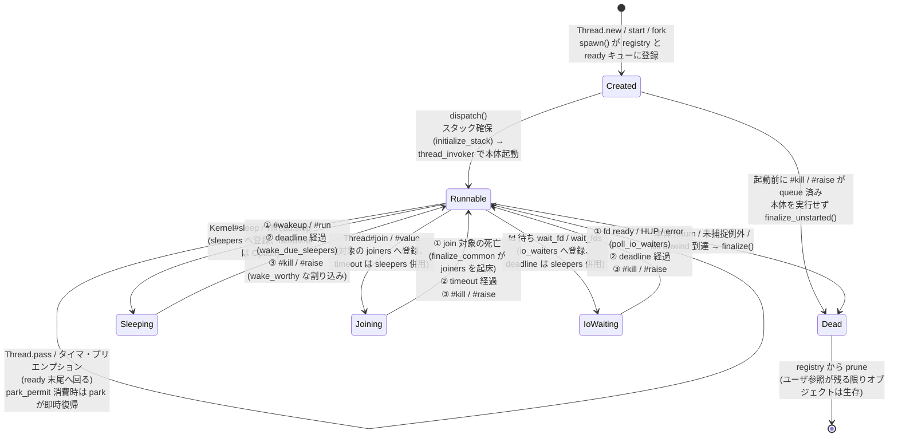
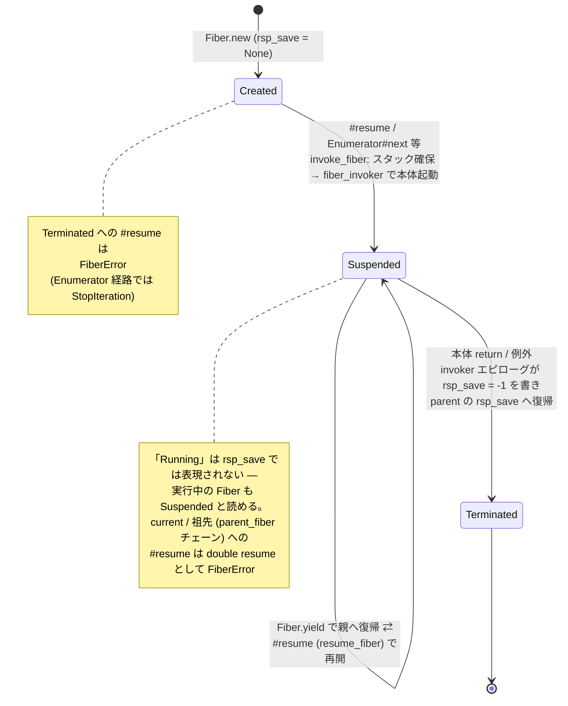
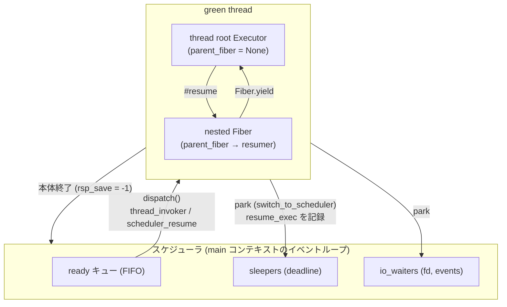

# Green thread スケジューラ: Thread / Fiber の状態遷移図

`doc/threads.md` の補足。スケジューラ(`src/scheduler.rs`)が管理する
`ThreadState`(`src/value/rvalue/thread.rs`)と、Fiber の
`FiberState`(`src/executor.rs` の `fiber_state()`)の状態遷移をまとめる。

## 1. Thread の状態遷移

`ThreadState` は 6 状態:

```
Created | Runnable | Sleeping | Joining | IoWaiting | Dead
```



### 遷移の詳細とコード対応

| 遷移 | トリガ | 実装箇所 (`scheduler.rs`) |
|---|---|---|
| `[*] → Created` | `Thread.new` が `ThreadInner::new` を生成、`spawn()` が `threads` + `ready` に登録 | `spawn` |
| `Created → Runnable` | ready から取り出され `dispatch()` が初回起動(スタック確保 → `thread_invoker`) | `dispatch` の `Entry::Invoke` |
| `Created → Dead` | 起動前に `#kill` / `#raise` が pending に積まれていた場合、本体を実行せず死亡(CRuby 意味論)。raise は終了例外として記録 | `dispatch` の `Entry::Skip` → `finalize_unstarted` |
| `Runnable → Sleeping` | `Kernel#sleep` / `Thread.stop`。deadline `None` = `#wakeup` されるまで | `sleep` |
| `Runnable → Joining` | `Thread#join` / `#value`。対象の `joiners` に登録。timeout 付きなら `sleepers` にも登録 | `join` |
| `Runnable → IoWaiting` | ブロックする IO / `IO.select`。fd ごとに `io_waiters` へ登録(1 スレッドが複数 fd を待てる) | `wait_fd` / `wait_fds` |
| `Runnable → Runnable` | `Thread.pass`(自発)、またはプリエンプション(`preempt.rs` のタイマが 10 ms ごとに poll フラグを立て、次のセーフポイントで `scheduler::pass` 相当)。ready 末尾へ | `pass` |
| `Runnable → Dead` | 本体の正常終了(`result` 記録)、未捕捉例外(`exception` 記録)、または kill unwind のスレッド root 到達(クリーンな死) | `dispatch` 復帰後の `finalize` |
| `Sleeping → Runnable` | `#wakeup` / `#run`(park 中でなければ `park_permit` を立てるだけで状態遷移なし)/ deadline 経過 / wake に値する割り込み | `wakeup_inner` / `wake_due_sleepers` / `interrupt` |
| `Joining → Runnable` | join 対象の死亡(`finalize_common` が `joiners` を一括起床)/ timeout / 割り込み | `finalize_common` / `wake_due_sleepers` / `interrupt` |
| `IoWaiting → Runnable` | `poll(2)` で fd が ready(HUP / error 含む — 起床側が再試行して実 errno を得る)/ deadline / 割り込み | `poll_io_waiters` / `wake_due_sleepers` / `interrupt` |
| `Dead → (prune)` | `finalize_common` が state を `Dead` にし、joiners を起こし、`threads` registry から除去 | `finalize_common` |

### 注意点

- **「Running」という状態はない**。`Runnable` は「ready キューにいる」と
  「現在実行中(`Scheduler::current`)」の両方を含む。
- **main スレッドは ready キューに入らない**。main が `Runnable` に戻ることが
  `scheduler_loop` の終了条件で、ループが return して main が再開する。
  各起床パス(`wakeup_inner` / `wake_due_sleepers` / `poll_io_waiters` /
  `interrupt` / `finalize_common`)はすべて `Some(t) != main` を確認してから
  ready に push する。
- **割り込みによる起床は「配送」ではない**。`#kill` / `#raise` は `pending`
  キューに積み、対象が park 中(`Sleeping | Joining | IoWaiting`)かつ
  マスクが全て `:never` でなければ `Runnable` に戻すだけ。実際の配送は
  `dispatch` の再開時(`Entry::ResumeInterrupt`: エラーをセットして 0 で
  resume → park していた `park_switch` が `Err` を返す)か、main なら
  `take_main_pending` で行われ、`Thread.handle_interrupt` のマスクに従う。
- **park_permit**(図中の self-loop): *running* な対象への
  `Thread#__wakeup_permit`(Mutex / Queue / ConditionVariable が使用)は
  `park_permit` を立て、対象の次の park は状態遷移せず即時復帰する。
  プリエンプション下の lost-wakeup 窓を塞ぐ(`doc/threads.md` §5)。
- **タイムアウト付き join / IO 待ちは二重登録**される(`joiners`/`io_waiters` と
  `sleepers` の両方)。どちらか一方の経路で起きたら他方のエントリは stale になり、
  `wake_due_sleepers` / `prune_io_waiters` が状態を再検査して破棄する。
  スプリアス起床は常に許容され、呼び出し元のループが条件を再検査する。
- **`Thread.allocate` の shell**(`Thread::Waiter` 等)は最初から `Dead` で
  生成され、スケジュールされない。

### `Thread#status` との対応

| `ThreadState` | `#status` | `#alive?` | `#stop?` |
|---|---|---|---|
| `Created` / `Runnable` | `"run"` | true | false |
| `Sleeping` / `Joining` / `IoWaiting` | `"sleep"` | true | true |
| `Dead`(正常終了 / kill) | `false` | false | true |
| `Dead`(例外終了) | `nil` | false | true |

## 2. Fiber の状態遷移

Fiber の状態は専用フィールドではなく `Executor::rsp_save` から導出される
(`fiber_state()`):

```
rsp_save == None  → Created
rsp_save == -1    → Terminated
それ以外          → Suspended
```



### 遷移の詳細とコード対応

| 遷移 | トリガ | 実装箇所 |
|---|---|---|
| `[*] → Created` | `Fiber.new`(`FiberInner::new`、スタック未確保) | `value/rvalue/fiber.rs` |
| `Created → Suspended`(実行開始) | 初回 `#resume` / `Enumerator#next` / Generator 起動。`initialize()` が 256 KiB スタックを確保し `rsp_save` にスタックトップを書く → `fiber_invoker` | `Fiber::invoke_fiber` / `invoke_fiber_with_self` |
| `Suspended ⇄ Suspended` | `Fiber.yield`(`yield_fiber`: 自分の `rsp_save` に現コンテキストを保存し `parent_fiber` へ switch)と `#resume`(`resume_fiber`: 逆方向) | `executor.rs` / `codegen/arch/*/invoker.rs` |
| `Suspended → Terminated` | 本体の return または例外。`fiber_invoker` のエピローグが `rsp_save = -1` を書いて parent へ復帰 | `codegen/arch/*/invoker.rs` |
| `Terminated → (エラー)` | `#resume` は `FiberError`("attempt to resume a terminated fiber")、Enumerator / Generator 経路は `StopIteration` | `Fiber::resume` / `enum_yield_values` / `generator_yield_values` |

### 注意点

- **エラー遷移(状態は変わらない)**:
  - 実行中の Fiber 自身、または `parent_fiber` チェーン上の祖先への
    `#resume` → `FiberError`(double resume。ライブなスタックへの switch は
    SIGSEGV になるため事前検査)。
  - `parent_fiber == None` のコンテキスト(main、および**スレッド root**)での
    `Fiber.yield` → `FiberError`("can't yield from main fiber")。
- **Thread との関係**: Thread は Fiber のスタック切替機構(`rsp_save` 交換)を
  土台にするが、スレッド root の `parent_fiber` は常に `None` で、切替は
  専用スタブ(`thread_invoker` / `switch_to_scheduler` / `scheduler_resume`)が
  `SCHED_RSP` 経由で行う。`ThreadInner::body_terminated()` は root Executor の
  `FiberState::Terminated`(= `rsp_save == -1`)で本体終了を検知し、これが
  Thread 側の `Runnable → Dead` 遷移(`finalize`)のトリガになる。
- **スレッド内にネストした Fiber**: green thread が nested Fiber の中で park
  した場合、`ThreadInner::resume_exec` は root ではなく park した Fiber の
  Executor を指し、スケジューラはそこへ直接 resume する(`parent_fiber`
  チェーンは切替をまたいで保存される)。

## 3. 2 つの状態機械の関係(全体図)



- スケジューラは Thread 単位でスケジュールし、Fiber の resume/yield は
  スレッド内で完結する(スケジューラは関与しない)。
- park はどの Fiber の中からでもよく、`resume_exec` が park した Executor を
  指すので、再開は park 地点へ直接戻る。
