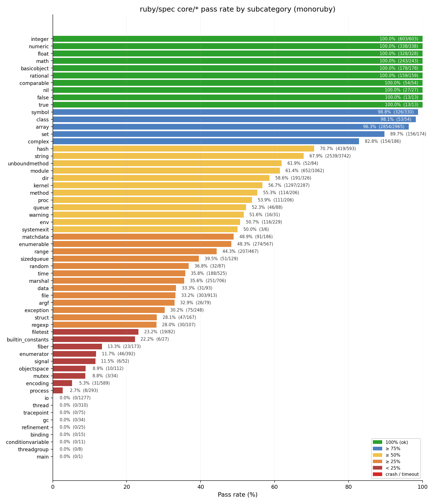

# ruby/spec core Survey — 2026-04-21

*monoruby vs ruby/spec (core categories).*

## Methodology

Each `core/<subcategory>/` directory under ruby/spec is invoked as a separate `mspec` run, in batches of 20 spec files with a 90-second timeout per batch, so that a crash in one file can only take down its own batch rather than the whole category. Batch outputs are captured byte-wise and a category is tagged:


- **ok** — all batches produced a summary line and no failures/errors were reported.
- **fail** — at least one example failed or errored but every batch ran to completion.
- **crash** — at least one batch exited before printing the `mspec` summary line. The number of files in that batch is recorded as `lost_files`.
- **timeout** — at least one batch hit the 90 s timeout.

The three specs that hang monoruby's single-threaded runtime are excluded up front (`io/copy_stream`, `io/select`, `kernel/readlines`). Pass-rate is computed as `max(0, examples − failures − errors) / examples`; errors can exceed examples when a `before :each` hook fails and re-raises once per example, so clamping to 0 is the honest lower bound.

## Environment

- monoruby: `monoruby 0.3.0` @ `d56254bb` (Add unit tests for Fiddle/FFI low-level builtins)
- reference ruby: `ruby 4.0.1 (2026-01-13 revision e04267a14b) +PRISM [x86_64-linux]`
- host: x86_64 Linux (WSL2)

## Totals

| Metric | Value |
|---|--:|
| Categories | 58 |
| Examples | 22,309 |
| Passed | 12,813 |
| Failed | 3,976 |
| Errors | 5,568 |
| Overall pass rate | **57.43%** |
| Categories at 100% | 10 |
| Categories with a crashing batch | 0 |
| Categories with a timing-out batch | 0 |



## Pass rate ranking

Sorted by pass rate descending; crash/timeout categories pushed to the bottom regardless of computed rate.

| # | Category | Files | Examples | Pass | Fail | Err | Rate | Status |
|---:|---|---:|---:|---:|---:|---:|---:|:---|
| 1 | `integer` | 67 | 603 | 603 | 0 | 0 | 100.00% | ✅ |
| 2 | `numeric` | 46 | 338 | 338 | 0 | 0 | 100.00% | ✅ |
| 3 | `float` | 50 | 328 | 328 | 0 | 0 | 100.00% | ✅ |
| 4 | `math` | 29 | 243 | 243 | 0 | 0 | 100.00% | ✅ |
| 5 | `basicobject` | 14 | 178 | 178 | 0 | 0 | 100.00% | ✅ |
| 6 | `rational` | 32 | 159 | 159 | 0 | 0 | 100.00% | ✅ |
| 7 | `comparable` | 7 | 54 | 54 | 0 | 0 | 100.00% | ✅ |
| 8 | `nil` | 18 | 27 | 27 | 0 | 0 | 100.00% | ✅ |
| 9 | `false` | 9 | 13 | 13 | 0 | 0 | 100.00% | ✅ |
| 10 | `true` | 9 | 13 | 13 | 0 | 0 | 100.00% | ✅ |
| 11 | `symbol` | 29 | 330 | 326 | 3 | 1 | 98.79% | ⚠️ |
| 12 | `class` | 8 | 54 | 53 | 1 | 0 | 98.15% | ⚠️ |
| 13 | `array` | 128 | 2965 | 2854 | 78 | 33 | 96.26% | ⚠️ |
| 14 | `set` | 53 | 174 | 156 | 0 | 18 | 89.66% | ⚠️ |
| 15 | `complex` | 43 | 186 | 154 | 28 | 4 | 82.80% | ⚠️ |
| 16 | `hash` | 68 | 593 | 419 | 103 | 71 | 70.66% | ⚠️ |
| 17 | `string` | 141 | 3742 | 2539 | 648 | 555 | 67.85% | ⚠️ |
| 18 | `unboundmethod` | 19 | 84 | 52 | 10 | 22 | 61.90% | ⚠️ |
| 19 | `module` | 84 | 1062 | 652 | 210 | 200 | 61.39% | ⚠️ |
| 20 | `dir` | 34 | 326 | 191 | 60 | 75 | 58.59% | ⚠️ |
| 21 | `kernel` | 116 | 2287 | 1297 | 508 | 482 | 56.71% | ⚠️ |
| 22 | `method` | 25 | 206 | 114 | 38 | 54 | 55.34% | ⚠️ |
| 23 | `proc` | 23 | 206 | 111 | 49 | 46 | 53.88% | ⚠️ |
| 24 | `queue` | 15 | 88 | 46 | 20 | 22 | 52.27% | ⚠️ |
| 25 | `warning` | 5 | 31 | 16 | 10 | 5 | 51.61% | ⚠️ |
| 26 | `env` | 44 | 229 | 116 | 99 | 14 | 50.66% | ⚠️ |
| 27 | `systemexit` | 2 | 6 | 3 | 0 | 3 | 50.00% | ⚠️ |
| 28 | `matchdata` | 29 | 186 | 91 | 20 | 75 | 48.92% | ⚠️ |
| 29 | `enumerable` | 60 | 567 | 274 | 117 | 176 | 48.32% | ⚠️ |
| 30 | `range` | 33 | 467 | 207 | 78 | 182 | 44.33% | ⚠️ |
| 31 | `sizedqueue` | 16 | 129 | 51 | 33 | 45 | 39.53% | ⚠️ |
| 32 | `random` | 10 | 87 | 32 | 10 | 45 | 36.78% | ⚠️ |
| 33 | `time` | 66 | 525 | 188 | 235 | 102 | 35.81% | ⚠️ |
| 34 | `marshal` | 6 | 706 | 251 | 167 | 288 | 35.55% | ⚠️ |
| 35 | `data` | 13 | 93 | 31 | 31 | 31 | 33.33% | ⚠️ |
| 36 | `file` | 112 | 913 | 303 | 176 | 434 | 33.19% | ⚠️ |
| 37 | `argf` | 20 | 79 | 26 | 16 | 37 | 32.91% | ⚠️ |
| 38 | `exception` | 39 | 248 | 75 | 84 | 89 | 30.24% | ⚠️ |
| 39 | `struct` | 29 | 167 | 47 | 33 | 87 | 28.14% | ⚠️ |
| 40 | `regexp` | 24 | 107 | 30 | 29 | 48 | 28.04% | ⚠️ |
| 41 | `filetest` | 24 | 82 | 19 | 20 | 43 | 23.17% | ⚠️ |
| 42 | `builtin_constants` | 1 | 27 | 6 | 5 | 16 | 22.22% | ⚠️ |
| 43 | `fiber` | 13 | 173 | 23 | 24 | 126 | 13.29% | ⚠️ |
| 44 | `enumerator` | 80 | 392 | 46 | 44 | 302 | 11.73% | ⚠️ |
| 45 | `signal` | 3 | 52 | 6 | 31 | 15 | 11.54% | ⚠️ |
| 46 | `objectspace` | 29 | 112 | 10 | 5 | 97 | 8.93% | ⚠️ |
| 47 | `mutex` | 7 | 34 | 3 | 3 | 28 | 8.82% | ⚠️ |
| 48 | `encoding` | 45 | 589 | 31 | 378 | 180 | 5.26% | ⚠️ |
| 49 | `process` | 92 | 293 | 8 | 43 | 242 | 2.73% | ⚠️ |
| 50 | `io` | 98 | 1277 | 0 | 423 | 888 | 0.00% | ⚠️ |
| 51 | `thread` | 53 | 310 | 0 | 99 | 218 | 0.00% | ⚠️ |
| 52 | `tracepoint` | 19 | 75 | 0 | 1 | 75 | 0.00% | ⚠️ |
| 53 | `gc` | 18 | 34 | 0 | 3 | 32 | 0.00% | ⚠️ |
| 54 | `refinement` | 8 | 25 | 0 | 0 | 25 | 0.00% | ⚠️ |
| 55 | `binding` | 9 | 15 | 0 | 1 | 14 | 0.00% | ⚠️ |
| 56 | `conditionvariable` | 4 | 11 | 0 | 1 | 10 | 0.00% | ⚠️ |
| 57 | `threadgroup` | 5 | 8 | 0 | 1 | 7 | 0.00% | ⚠️ |
| 58 | `main` | 7 | 1 | 0 | 0 | 6 | 0.00% | ⚠️ |

## Reproduction

```bash
# From the monoruby checkout, with ruby/spec cloned at ../spec and ../mspec:
cargo install --path monoruby
bin/spec        # runs all categories serially with a crash-fencing batching strategy
```

The survey driver in this document used a custom `spec_runner.sh` that additionally
records per-category logs under `/tmp/spec_logs/` and emits a machine-readable CSV;
it is functionally equivalent to `bin/spec` plus post-processing.
